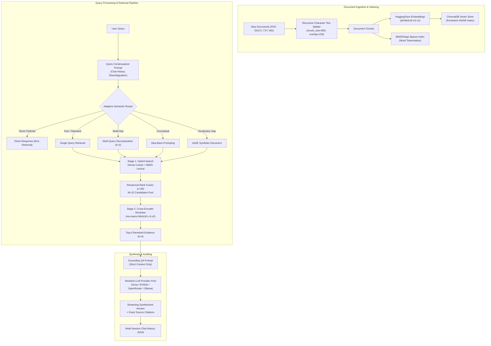

# Systems Architecture & Engineering Reference

This document provides a comprehensive technical overview of the **RAG Evaluation Suite** architecture, component interactions, mathematical formulations, and engineering design decisions.

---

## 1. High-Level System Architecture

---

## 2. Ingestion & Preprocessing Pipeline

- **Text Splitter**: LangChain [`RecursiveCharacterTextSplitter`](file:///d:/AI%20Projects/RAG%20with%20Evals/src/vectorstore.py)
  - `chunk_size`: 800 characters
  - `chunk_overlap`: 150 characters
  - `separators`: `["\n\n", "\n", " ", ""]`
  - *Engineering Rationale*: 800 characters provides an adequate semantic window for paragraph-level reasoning while fitting comfortably within the 512-token limit of small embedding models. Overlap ensures named entities, statutory citations, and clauses split across chunk boundaries remain intact.
- **Supported File Formats**: PDF (`pypdf`), TXT, Markdown, DOCX (`python-docx`).
- **Corpus Dynamic Invalidation**: Whenever new documents are indexed or cleared, the BM25 sparse index cache is automatically invalidated and reconstructed from active ChromaDB documents.

---

## 3. Vector Storage & Lexical Search

### 3.1 ChromaDB Persistent Vector Store
- **Database**: `ChromaDB` (Local persistent SQLite metadata storage + HNSW binary vector index).
- **Storage Location**: `storage/chroma/` (excluded from version control).
- **Distance Function**: Cosine distance ($1 - \text{cosine\_similarity}$).
- **Singleton Management**: [`VectorStoreManager`](file:///d:/AI%20Projects/RAG%20with%20Evals/src/vectorstore.py) handles atomic updates, collection statistics, and chunk metadata tracking.

### 3.2 BM25Okapi Sparse Retrieval
- **Library**: `rank_bm25`
- **Corpus Generation**: Dynamically extracts text passages directly from the indexed ChromaDB collection.
- **Tokenization**: Regex-based tokenization with case-folding and punctuation filtering.

### 3.3 Reciprocal Rank Fusion (RRF)
To unify sparse lexical scores with dense similarity ranks without calibration mismatches, Reciprocal Rank Fusion is applied:

$$RRF(d) = \sum_{m \in M} \frac{w_m}{c + r_m(d)}$$

Where:
- $c = 60$ (smoothing constant preventing high-rank dominance).
- $w_{\text{dense}} = 0.5$, $w_{\text{bm25}} = 0.5$ (equal weight distribution).
- $r_m(d)$ is the 1-based rank of document $d$ in system $m$.

---

## 4. Two-Stage Cross-Encoder Reranking (Phase 3)

Bi-encoders generate embeddings independently for query and document ($\vec{q}$ and $\vec{d}$), losing fine-grained cross-token attention.

### Cross-Encoder Architecture
- **Model**: `cross-encoder/ms-marco-MiniLM-L-6-v2` via HuggingFace `sentence-transformers`.
- **Mechanism**: 6-layer BERT architecture computing all-to-all cross-attention between concatenated `[CLS] query [SEP] passage [SEP]`.
- **Candidate Pool**: Stage 1 Hybrid retrieval fetches $M=15$ candidate passages. All 15 candidates are evaluated by the cross-encoder, re-ranked descending by logit score, and pruned down to Top-$k=4$.
- **Sigmoid Calibration**: Raw unbounded logits $s$ are mapped to a calibrated confidence percentage:

$$\sigma(s) = \frac{1}{1 + e^{-s}}$$

- **Audit Movement Metric**: Tracks bidirectional rank movements:

$$\Delta = \text{initial\_rank} - \text{new\_rank}$$

A positive $\Delta$ indicates a candidate was promoted, while a negative $\Delta$ indicates suppression of irrelevant noise.

---

## 5. Query Transformation & Semantic Routing (Phase 4)

Located in [`src/query_transform.py`](file:///d:/AI%20Projects/RAG%20with%20Evals/src/query_transform.py):

### 5.1 Multi-Query Expansion
Deconstructs compound, comparative questions into $N=3$ orthogonal sub-queries executed against the index. Candidate pools across sub-queries are merged and deduplicated.

### 5.2 Hypothetical Document Embeddings (HyDE)
Generates a dense synthetic document passage in formal legal/reporting tone to bridge the semantic vocabulary gap for abstract questions before dense retrieval.

### 5.3 Step-Back Prompting
Formulates high-level foundational questions capturing background international legal context or treaty frameworks.

### 5.4 Adaptive Semantic Router
Fast intent classifier categorizing queries into:
- `DIRECT`: Conversational greetings/chitchat (0ms vector retrieval bypass).
- `FACT_LOOKUP`: Standard direct hybrid retrieval.
- `MULTI_HOP`: Decomposed parallel multi-query execution.
- `CONCEPTUAL`: Step-back abstraction.
- `HYDE`: Synthetic document embedding.

---

## 6. Multi-Provider Resilient Inference Pool

The system decouples inference from proprietary single-vendor dependencies through a resilient failover pool:

| Provider | Model Default | Role / Capability | Fallback Target |
| :--- | :--- | :--- | :--- |
| **Groq Cloud** | `qwen/qwen3.8-27b` | Sub-second streaming inference | OpenRouter / Ollama |
| **NVIDIA NIM** | `meta/llama-3.2-11b-vision-instruct` | High-throughput enterprise gateway | Groq / Ollama |
| **OpenRouter** | `openrouter/free` | Multi-vendor fallback coverage | Groq / Ollama |
| **Ollama** | `llama3.1:8b` | 100% offline, rate-limit immune local LLM | Local fallback |

Provider failovers use LangChain's native `.with_fallbacks()` mechanism to automatically handle HTTP 429 rate limits or transient network disruptions without dropping evaluation batches.

---

## 7. Conversational Memory & Persistence

Managed by [`ChatHistoryManager`](file:///d:/AI%20Projects/RAG%20with%20Evals/src/memory.py):
- Individual sessions stored as structured JSON in `storage/history/{session_id}.json`.
- Internal eval runs use isolated temporary session IDs (e.g. `eval_q_01`) that are purged post-evaluation to prevent cross-turn contamination.
- Full turn metadata includes timestamps, retrieved chunks, initial vs reranked scores, and query transformation audits.
